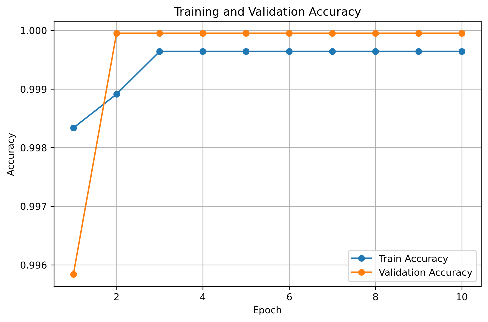
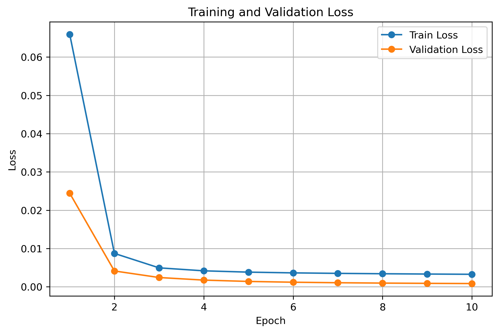

# detecting-cybersecurity-threats-using-deep-learning
# Cyber Threat Detection with Deep Learning

## Project Overview

This project aims to detect cyber threats using deep learning. The task is a binary classification problem, where the model predicts whether a system event is:

- **0 = benign**
- **1 = malicious**

I chose this topic because cybersecurity is a highly relevant real-world problem. Attacks such as malware, phishing, and denial-of-service can seriously affect organizations, so building a model that can automatically detect suspicious activity is both practical and meaningful.

For this project, I used the **BETH dataset**, a real cybersecurity dataset created for anomaly detection research. I selected this dataset because it contains modern and fully labeled cyber event data, which makes it suitable for training a deep learning model.

---

## Objective

The goal of this project was to build a model that can distinguish malicious events from normal ones. To achieve this, I prepared the dataset, scaled the input features, split the data into training and validation sets, and trained an **Artificial Neural Network (ANN)**.

I chose ANN because it is effective for classification tasks and can learn complex patterns from structured data.

---

## Results

### Training and Validation Accuracy

The model achieved very strong accuracy from the first epochs.

- At **epoch 1**, training accuracy was **0.9983** and validation accuracy was **0.9958**.
- At **epoch 2**, validation accuracy already reached **1.0000**.
- From **epoch 3 to epoch 10**, training accuracy remained around **0.9996**, while validation accuracy stayed at **1.0000**.
- The final validation accuracy printed in the code was **0.9999523726364921**, which is about **99.995%**.

These results show that the model learned the classification pattern very quickly and maintained extremely stable performance across epochs.

### Training and Validation Loss

The loss values also decreased sharply during training.

- At **epoch 1**, training loss was **0.0659** and validation loss was **0.0244**.
- At **epoch 2**, training loss dropped to **0.0087** and validation loss dropped to **0.0041**.
- By **epoch 10**, training loss decreased further to **0.0033**, while validation loss reached **0.0008**.

This steady reduction in both training and validation loss indicates that the model converged well and improved rapidly during training.

---

## Interpretation

The results suggest that the ANN performed very effectively on this dataset. The model reached near-perfect validation accuracy after only two epochs, and both loss curves continued to decrease smoothly until the end of training.

This means the model was able to separate benign and malicious events very well. The combination of **very high accuracy** and **very low loss** supports the conclusion that deep learning is effective for this cyber threat detection task on the BETH dataset.

---

## Conclusion

Overall, this project shows that an ANN can be successfully applied to cyber threat detection. I chose this topic because it connects deep learning with a practical cybersecurity problem, and the final results confirm that the model can classify malicious and benign events with excellent performance.
